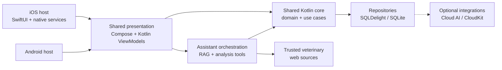

<div align="center">

# Animally

**An offline-first equine veterinary record app for iOS.**

Built for day-to-day internship documentation, patient follow-up, and a more useful view of the information that accumulates around a horse's care.

[Architecture](./ARCHITECTURE.md) · [Codebase structure](./STRUCTURE.md) · [Feature ideas](./docs/FEATURE_IDEAS.md) · [Demo data](./fixtures/README.md) · [Quality & SonarQube](./config/sonar/README.md)

</div>

> [!WARNING]
> Animally is an actively developed personal project, not a certified medical device or a substitute for professional veterinary judgement. Always review records, reminders, AI suggestions, and extracted dictation before relying on them in practice.

## Why Animally?

Veterinary work generates a lot of small, time-sensitive pieces of information: examination notes, treatments, images, reproduction events, follow-ups, and conversations with owners. Animally brings those pieces together in one local-first workspace designed around equine patients.

The project is currently **iOS-first**, while keeping its business rules, persistence contracts, and use cases in shared Kotlin so the foundation remains portable and straightforward to extend.

## Highlights

### Clinical records

- Manage equine patients, owners, contacts, and owner locations.
- Keep consultations, anamneses, lameness cases, medications, substances, lab results, imaging, surgery, dentistry, farrier visits, vaccinations, and deworming in one patient history.
- Track reproduction workflows including breeding, follicle checks, ultrasounds, gestation, reproductive medication, embryo transfer, and related events.
- Follow weight history, upcoming care, reminders, and notifications from a single timeline.

### Assistant, analysis, and dictation

- Ask questions about the records stored in the app and receive answers grounded in those records.
- Use basic data-analysis tools for patient counts, weight trends, gestation, breeding, and farrier-related information.
- Display source groups and record links so an answer can be checked against the underlying data.
- Optionally consult trusted veterinary references, including the [MSD Veterinary Manual](https://www.msdvetmanual.com/) and [Europe PMC](https://europepmc.org/), when a question calls for external medical information.
- Use on-device Apple Foundation Models where supported, or configure an OpenAI-compatible cloud model as an optional fallback.
- Dictate in English or Portuguese, review and edit the transcript, extract suggested records, and keep the original audio for later playback.
- Keep recent assistant conversations and a searchable dictation archive instead of losing the source material after extraction.

AI output is intentionally treated as an assistive layer: the application should prefer the available records, acknowledge missing information, and make citations or record links inspectable. Grounding improves reliability, but it does not remove the need for clinical review.

### Search, organisation, and export

- Search across patient-centred records and navigate through a unified timeline.
- Expand and collapse dense record sections so large histories remain usable on a phone.
- Attach images and files to records and view them from the relevant detail screen.
- Export CSV data, generate patient reports as PDF, and create JSON/database backups for recovery or transfer.
- Personalise appearance with light, dark, or system theme modes and selectable accent colours.

### Optional integrations

- Open owner locations in Apple Maps through the iOS MapKit integration.
- Store cloud-provider credentials in the iOS Keychain rather than in the source tree.
- iOS CloudKit synchronisation support exists behind its sync settings and can remain disabled for a fully local workflow.

## Architecture



The architectural boundary is deliberate:

- **Shared Kotlin owns the business logic.** Domain models, repositories, use cases, persistence, search, RAG orchestration, analysis tools, validation, and cross-platform state live in `shared`.
- **Swift owns iOS presentation and platform integration.** SwiftUI screens and adapters provide iOS-native experiences such as speech recognition, audio capture/playback, MapKit, Keychain access, and Foundation Models bridging.
- **Android remains a thin application host.** It uses the shared core and platform implementations without duplicating domain rules in the UI layer.
- **Persistence is local-first.** SQLDelight provides the SQLite schema and generated query layer; platform-specific drivers and file storage are supplied through Kotlin Multiplatform `expect`/`actual` implementations.

For the detailed layer map and data flows, see [ARCHITECTURE.md](./ARCHITECTURE.md). For feature locations and conventions, see [STRUCTURE.md](./STRUCTURE.md). Architectural decisions are recorded in [`docs/adr`](./docs/adr/).

## Platform support

| Target | Status | Notes |
| --- | --- | --- |
| **iOS** | Primary target | iOS host with SwiftUI and native integrations; deployment target is iOS 18.2. The shared module builds for `iosArm64` and `iosSimulatorArm64`. |
| **Android** | Supported application host | Thin Android application around the shared Kotlin module; cloud/on-device AI availability differs from iOS. |
| **Desktop JVM** | Development/test target | Useful for shared logic and headless tests; there is not currently a distributed desktop application. |

## Technology

- [Kotlin Multiplatform](https://www.jetbrains.com/help/kotlin-multiplatform-dev/get-started.html) for the portable core.
- [Compose Multiplatform](https://www.jetbrains.com/compose-multiplatform/) and Kotlin ViewModels for shared presentation/state.
- SwiftUI for the iOS shell and native experiences.
- [SQLDelight](https://cashapp.github.io/sqldelight/) over SQLite for typed persistence and migrations.
- [Koin](https://insert-koin.io/) for dependency injection.
- [Ktor](https://ktor.io/) and Kotlin serialization for network and structured data flows.
- MapKit, Speech, AVFoundation, Keychain, and CloudKit for iOS platform capabilities.
- Detekt, KtLint, Android Lint, Kover, and SonarQube for automated quality checks.

## Getting started

### Prerequisites

- macOS with Xcode for the iOS application and simulator.
- A compatible JDK and the Android SDK for Gradle/Kotlin and Android builds.
- CocoaPods or other additional tooling is not required by the current project setup.

### Clone and initialise

```bash
git clone https://github.com/rodrigotimoteo/Animally.git
cd Animally

# Optional: install the repository's pre-commit quality hook.
./gradlew installGitHooks
```

### Build Android

```bash
./gradlew :androidApp:assembleDebug
```

### Run iOS

Open [`iosApp/iosApp.xcodeproj`](./iosApp/iosApp.xcodeproj) in Xcode, choose the `iosApp` scheme, and run it on a simulator or a connected device.

The iOS target requests microphone and speech-recognition permissions when those features are used. Full dictation and on-device Foundation Model behaviour depends on the hardware, OS, permissions, and model availability of the device.

### Load fictional demo data

The repository includes [`fixtures/demo-equine-herd.json`](./fixtures/demo-equine-herd.json), a fictional schema-v1 backup containing horses, owners, reproduction records, preventive care, weights, and a small lameness case.

In the app, use **Settings → Restore Backup** and select the fixture. Restore replaces the current local database, so export anything valuable first. Read the [fixture guide](./fixtures/README.md) for the complete scenario and safety notes.

### Configure optional cloud AI

Cloud AI is not required for local record keeping. When enabled from the app's settings, Animally can use an OpenAI-compatible provider and model to answer grounded questions or structure dictation. Configure credentials through the app rather than committing them to the repository. Treat cloud processing according to the provider's privacy and retention policy.

## Verification

Run the smallest relevant check while developing, or the shared gate before opening a release candidate:

```bash
# Shared Kotlin tests
./gradlew :shared:testAndroidHostTest
./gradlew :shared:iosSimulatorArm64Test

# Static analysis and formatting
./gradlew :shared:ktlintCheck :shared:detekt

# Combined local shared-module gate
./gradlew :shared:testAndroidHostTest \
  :shared:iosSimulatorArm64Test \
  :shared:ktlintCheck \
  :shared:detekt
```

The optional SonarQube quality gate is available through:

```bash
./gradlew quality
```

It requires a configured SonarQube/SonarCloud server. See the [SonarQube setup and quality policy](./config/sonar/README.md) before running it in a new environment.

For repeatable iOS simulator interaction, the repository includes a dependency-free helper based on `xcrun` and `osascript`:

```bash
scripts/sim-e2e.sh boot
scripts/sim-e2e.sh build
scripts/sim-e2e.sh install
scripts/sim-e2e.sh launch
```

See [`scripts/README-e2e.md`](./scripts/README-e2e.md) for simulator setup, screenshots, coordinate handling, and environment overrides. The iOS UI test suite is available under [`iosApp/iosUITests`](./iosApp/iosUITests).

## Data, privacy, and safety

- Patient records, chat history, dictation transcripts, and metadata are designed to live locally by default.
- Audio recordings stay in platform file storage and are kept alongside their transcript metadata until the user removes them.
- Backups and exports are explicit user actions; restoring a backup replaces local data and should be treated accordingly.
- Cloud AI and CloudKit are opt-in integrations. Data sent to a cloud model is governed by the selected provider's policies.
- API credentials are handled through the platform settings/keychain path and must never be committed to Git.
- The demo fixture contains fictional data only; do not use it as a clinical protocol or diagnostic reference.
- AI responses, web references, reminders, and extracted dictation are aids for reviewing the record, not autonomous medical decisions.

## Repository map

```text
Animally/
├── androidApp/             # Android application host
├── iosApp/                 # iOS host, SwiftUI screens, native integrations, UI tests
├── shared/
│   ├── src/commonMain/     # Shared domain, data, presentation, and infrastructure
│   ├── src/androidMain/    # Android platform implementations
│   ├── src/iosMain/        # iOS platform implementations and Swift bridges
│   ├── src/desktopMain/    # Desktop/JVM implementations
│   └── src/*Test/          # Common, Android host, iOS simulator, and desktop tests
├── fixtures/               # Fictional backups for QA and assistant evaluation
├── config/sonar/           # SonarQube setup and quality policy
├── scripts/                # iOS simulator E2E helper and documentation
├── docs/adr/               # Architecture decision records
├── ARCHITECTURE.md         # Layering, data flow, and design contracts
└── STRUCTURE.md            # Feature map and code placement conventions
```

## Development principles

When extending Animally, keep the codebase easy to change:

1. Put business rules and persistence-independent behaviour in shared Kotlin.
2. Keep Swift focused on iOS presentation and platform APIs; do not duplicate domain logic in SwiftUI screens.
3. Add or update focused tests with behaviour changes, especially around migrations, record relationships, assistant grounding, and dictation extraction.
4. Prefer existing repository, use-case, dispatcher, storage, and navigation patterns over new parallel abstractions.
5. Record significant structural decisions in an ADR and run the relevant quality checks before committing.

## Current scope

Animally is intentionally evolving:

- iOS is the primary product experience; Android provides the second application host and shared-core coverage.
- Native iOS speech and Foundation Model features require appropriate device and OS support, while cloud AI remains optional.
- CloudKit synchronisation is available behind its settings and is not required for local-only use.
- Native iOS execution is covered by simulator/UI checks, while Kover's coverage reports focus on the JVM/Android/desktop testable code; see the [SonarQube notes](./config/sonar/README.md) for the exact scope.

## Contributing

This is currently a personal project, but thoughtful issue reports, test cases, and improvements are welcome. Before making a larger change, read the [architecture](./ARCHITECTURE.md) and [structure](./STRUCTURE.md) guides, keep platform-specific code at the platform boundary, and include verification steps in the pull request description.

## License

No license has been published for this repository yet. Until one is added, the code should be treated as all rights reserved and not reused or redistributed without permission.
